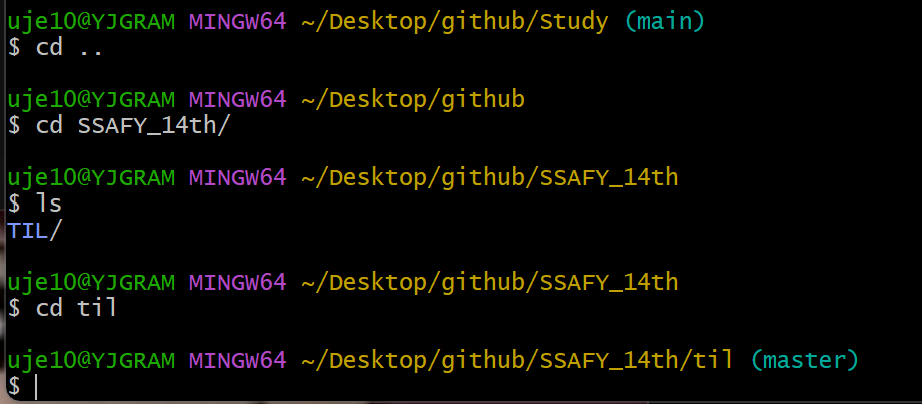

- [궁금증 1 - bash](#궁금증-1---bash)
  - [원인: 기본 브랜치 이름의 변화](#원인-기본-브랜치-이름의-변화)
  - [해결](#해결)
  - [더 알아볼 점](#더-알아볼-점)
- [궁금증 2 - dir과 ls의 차이는?](#궁금증-2---dir과-ls의-차이는)
  - [해결](#해결-1)

# 궁금증 1 - bash

예전에 clone했던 WD는 (main)으로 뜨고

- 최근에 clone한 WD는 (master)로 뜨는 이유가 뭘까?

## 원인: 기본 브랜치 이름의 변화

| 시기  | 기본 브랜치명  | 비고            |
| --- | -------- | ------------- |
| 예전  | `master` | Git의 초기 기본값   |
| 최근  | `main`   | GitHub 등에서 권장 |

- `master`는 과거부터 사용되던 기본 브랜치명

- 최근에는 인종차별 면으로 중립적인 표현인 `main`을 기본 브랜치로 사용

- GitHub가 2020년 이후 기본 브랜치를 `main`으로 변경함

## 해결

   0.사실 크게 문제되는 게 아니라 바꾸지 않아도 된다고 하나, 통일하고 싶어서 수정.

1. github에서 branch명을 main -> master로 변경

2. 기존 working directory(Study) 지우고 다시 clone하기
   
   1. ...근데 왜 안 지워질까?
   
   
   
   
   
   GPT 왈: 현재 상황은 `rm -r Study/` 명령어를 통해 디렉토리를 삭제하려 했으나, 해당 디렉토리 내 일부 파일이 **"write-protected (쓰기 금지)"** 상태라서 삭제 전에 **하나하나 'y'로 삭제 여부를 물어보고 있는** 것입니다.
   
   ---
   
   🔧 해결 방법: 강제로 묻지 않고 삭제하기
   
   `rm -rf Study/`
   
   - `-r` : 재귀적으로 디렉토리 삭제
   
   - `-f` : 강제 삭제 (`force`) → **쓰기 금지 파일이 있어도 묻지 않고 삭제**
   3. 오케이.
   
   
   4. 다시 clone
   
   

3. 완료!
   
   

## 더 알아볼 점

- 대체 branch는 무엇인가..?
  
  - 프로젝트를 진행할 때 branch(가지)를 여러개 두고 각자 작업하다가 최종에서 user에게 배포할 버전이 나오면 master(main) branch에 올려둔다고 한다
  
  - 하지만 자세히는 아직 잘 모르겠다

- 곧 git 심화 시간에 자세히 배운다고 하니 그 때 다시 정리해보도록 하자

# 궁금증 2 - dir과 ls의 차이는?

- 색깔차이..?
  
  

- 

## 해결

- 둘이 비슷한 동작을 하나, 사용되던 운영체제가 달라서 따로 있다고 한다.
  
  | 항목                    | `ls`                    | `dir`                       |
  | --------------------- | ----------------------- | --------------------------- |
  | 원래 운영체제               | Linux / Unix 계열         | Windows                     |
  | 색상 지원                 | 있음 (기본적으로 파일/디렉토리 색 구분) | 없음 (기본적으로 흑백 출력)            |
  | 출력 형식                 | 짧고 간단                   | 길고 자세함 (Windows에선 날짜/시간 포함) |
  | 옵션                    | `-l`, `-a` 등 다양         | 거의 없음                       |
  | Git Bash 등에서 사용 가능 여부 | O                       | O                           |

- window의 cmd에서 둘을 찍어보면 차이를 확실히 알 수 있다.
  

- git bash에선 `ls` 가 여러모로 편하고 좋아보인다.
